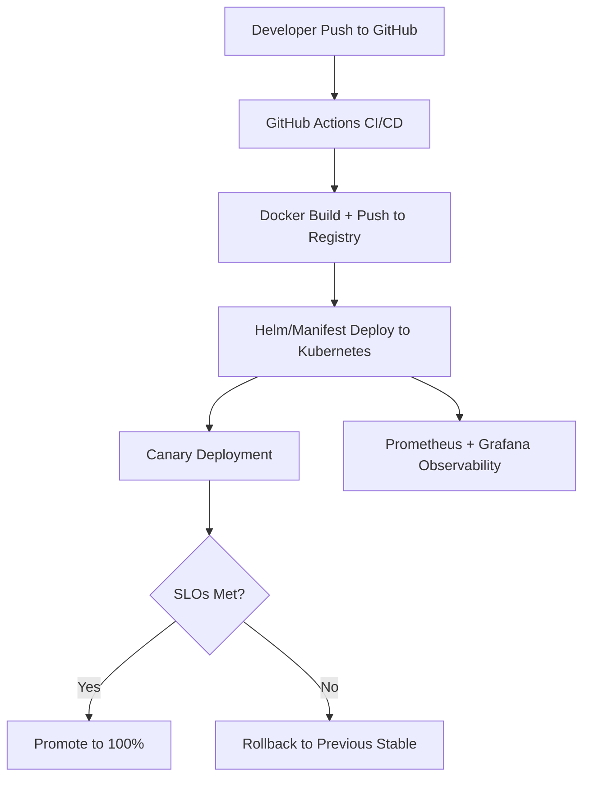

# microservice_rollout_monitoring
Leverage CI/CD to monitor releases in a GitHub environment and ensure releases are meeting SLO expectations

# Canary Deployment & Observability Lab

## Objective

Design and implement a robust CI/CD pipeline that deploys a containerized application to Kubernetes using a canary strategy, while observing rollout health through Prometheus metrics and SLO enforcement.

This project simulates a simplified version of Netflix's real-world safe deployment practices.

## Architecture Overview



## Tech Stack

| Component         | Tool                         |
|------------------|------------------------------|
| CI/CD            | GitHub Actions / Jenkins     |
| Deployment       | Kubernetes + Helm / Kustomize|
| Observability    | Prometheus + Grafana         |
| Metrics Export   | Custom `/metrics` endpoint   |
| Rollout Strategy | Manual or Flagger/Argo Rollouts|
| Container Build  | Docker                       |
| Infra (Local)    | Minikube / Kind              |
| Infra (Cloud)    | Azure AKS / AWS EKS (optional) |

## Requirements

### 1. CI/CD Pipeline
- GitHub Actions or Jenkinsfile-based automation
- Build Docker image and push to a container registry
- Deploy via Helm/Kustomize
- Canary rollout (10% → 100%) with auto-promotion or rollback based on metrics

### 2. Kubernetes Deployment
- A simple REST API app (Node.js or Python Flask/FastAPI)
- Exposes `/metrics` endpoint (Prometheus format)
- Helm chart or manifests should support:
  - Canary vs primary deployment
  - Traffic shifting logic (via NGINX or Service mesh optional)

### 3. Observability
- Prometheus setup to scrape the app
- Metrics to expose:
  - `http_requests_total`
  - `http_requests_errors_total`
  - `deployment_version`
- Grafana dashboard with:
  - Error rates
  - Deployment success
  - Rollout timeline

### 4. SLOs and SLIs
Document the following:
- SLI: % of successful HTTP 2xx responses
- SLO: 99.5% availability for new deployments
- Burn rate alerting (Prometheus alert rules)

### 5. Rollback Automation
- Fail the deployment if error rate exceeds 2% in the first 5 mins
- Automatically rollback to last stable image/tag
- Bonus: Slack/Webhook notification for rollback events

## Project Structure

```
.
├── .github/workflows/deploy.yml     # GitHub Actions pipeline
├── app/                             # Simple web API
│   └── main.py
├── Dockerfile
├── helm/
│   ├── Chart.yaml
│   ├── templates/
│   │   └── deployment.yaml
│   │   └── service.yaml
├── monitoring/
│   ├── prometheus.yaml              # Scrape config
│   ├── alert_rules.yaml
│   └── grafana_dashboards/
├── README.md
```

## Testing the Rollout

- Trigger a manual GitHub Actions run with a new app version
- Monitor rollout in Grafana
- Simulate errors (e.g., add a 500 response under certain condition)
- Validate auto-rollback behavior

## Bonus Points

- Use Flagger or Argo Rollouts for advanced canary logic
- Integrate Slack or MS Teams webhook for deployment notifications
- Add OpenTelemetry traces to the service
- Create a `deployment_report.md` summarizing each rollout

## Deliverables

| File | Description |
|------|-------------|
| `README.md` | This file |
| `deploy.yml` / `Jenkinsfile` | Your deployment automation |
| `metrics.py` or `main.py` | App exposing Prometheus metrics |
| `alert_rules.yaml` | Prometheus SLO breach alerts |
| `grafana_dashboards/` | Dashboard JSON or screenshots |
| `deployment_report.md` | Example canary rollout + analysis |

## References

- [Safe Updates of Client Applications at Netflix](https://netflixtechblog.com/safe-updates-of-client-applications-at-netflix-c017f4c264e0)
- [Google SRE Workbook - SLIs and SLOs](https://sre.google/workbook/monitoring/)
- [Prometheus Docs](https://prometheus.io/docs/)
- [GitHub Actions Docs](https://docs.github.com/en/actions)
- [Flagger](https://docs.flagger.app/)
- [Argo Rollouts](https://argoproj.github.io/argo-rollouts/)

## Let’s Build

Start small. Build the CI/CD flow, deploy the app, and iterate through observability and rollback logic. You're building muscle memory in what could be a core scenario at Netflix.
