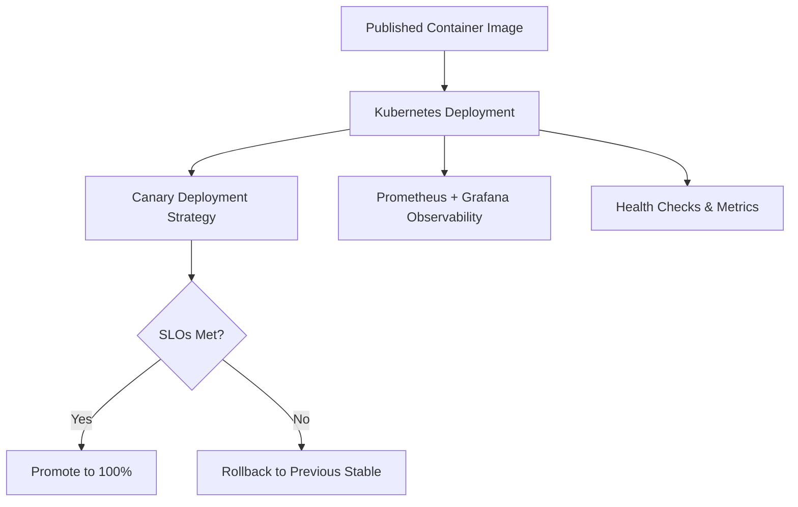

# Observability Demo - Canary Deployment Kubernetes Manifests

## Overview

This repository contains Kubernetes manifests and documentation for deploying the **Observability Demo Microservice** using canary deployment strategies. The microservice is pre-built and available as a container image.

## 🚀 Quick Start

### Using the Published Container

The observability demo app is available as a ready-to-use container:

```bash
# From GitHub Container Registry (recommended)
docker run -p 5000:5000 ghcr.io/knappmi/observability-demo-app

# From Docker Hub (alternative)
docker run -p 5000:5000 knappmi/observability-demo-app
```

### Kubernetes Deployment

Deploy to your Kubernetes cluster using the provided manifests:

```bash
# Deploy the stable version
kubectl apply -f k8s/stable/

# Deploy with canary strategy
kubectl apply -f k8s/canary/
```

## Architecture Overview



## 🛠 Tech Stack

| Component         | Tool/Service                 |
|------------------|------------------------------|
| **Container Image** | `ghcr.io/knappmi/observability-demo-app` |
| **Deployment**   | Kubernetes Manifests        |
| **Observability** | Prometheus + Grafana        |
| **Metrics**      | Built-in `/metrics` endpoint |
| **Rollout Strategy** | Manual Canary / Flagger    |
| **Local Testing** | Minikube / Kind / Docker Desktop |
| **Cloud Options** | AKS / EKS / GKE              |

## 📋 What's Included

- **Kubernetes Manifests**: Ready-to-deploy YAML files for stable and canary deployments
- **Monitoring Setup**: Prometheus and Grafana configurations
- **Canary Scripts**: Automated canary deployment and rollback scripts
- **Documentation**: Complete setup and usage guides
- **Testing Tools**: Health check and load testing utilities

## 🎯 Features

### Observability Demo App
The published container includes:

- **OpenTelemetry Integration**: Distributed tracing support
- **Prometheus Metrics**: Built-in `/metrics` endpoint with custom metrics
- **Health Checks**: Kubernetes-ready `/health` endpoint
- **Failure Simulation**: Configurable error rates and latency for testing
- **Version Identification**: Clear version labeling for canary deployments

### Kubernetes Deployments

- **Stable Deployment**: Production-ready baseline deployment
- **Canary Deployment**: Traffic-splitting canary strategy
- **Service Mesh Ready**: Compatible with Istio, Linkerd
- **Auto-scaling**: HPA configurations included

## 🔧 Environment Variables

Configure the observability demo app behavior:

| Variable | Default | Description |
|----------|---------|-------------|
| `SIM_BAD` | `false` | Enable failure simulation |
| `ERROR_RATE` | `0.05` | Error rate (0.0-1.0) when SIM_BAD=true |
| `LATENCY_SIMULATION` | `false` | Enable artificial latency |
| `MAX_LATENCY` | `1.0` | Maximum latency in seconds |
| `VERSION_LABEL` | `v1.0.0-stable` | Custom version identifier |

## 📊 Monitoring & SLOs

### Built-in Metrics
- HTTP request rates and error rates
- Response time percentiles
- Application health status
- Custom business metrics

### SLOs (Service Level Objectives)
- **Availability**: 99.5% uptime during deployments
- **Error Rate**: < 2% failed requests during canary phase
- **Latency**: 95th percentile < 500ms

### Alerting
- Prometheus alert rules for SLO violations
- Automatic rollback triggers
- Notification integrations (Slack, email)

## 📁 Repository Structure

```text
├── k8s/                           # Kubernetes manifests
│   ├── stable/                    # Stable deployment
│   ├── canary/                    # Canary deployment
│   └── monitoring/                # Prometheus & Grafana setup
├── docs/                          # Documentation
├── tests/                         # Testing scripts
├── README.dockerhub.md            # Container usage guide
└── README.md                      # This file
```

## 🚀 Getting Started

### Prerequisites
- Kubernetes cluster (local or cloud)
- kubectl configured
- Docker (for local testing)

### Step 1: Test Locally
```bash
# Quick test of the container
docker run -p 5000:5000 ghcr.io/knappmi/observability-demo-app

# Test with failure simulation
docker run -p 5000:5000 -e SIM_BAD=true -e ERROR_RATE=0.3 ghcr.io/knappmi/observability-demo-app
```

### Step 2: Deploy to Kubernetes
```bash
# Deploy stable version
kubectl apply -f k8s/stable/

# Deploy monitoring stack
kubectl apply -f k8s/monitoring/

# Deploy canary (after stable is running)
kubectl apply -f k8s/canary/
```

### Step 3: Monitor the Deployment
- Access Grafana dashboard
- Monitor canary metrics
- Observe automated rollback (if configured)

## 📚 Documentation

- **[Container Usage Guide](README.dockerhub.md)**: Complete guide for using the published container
- **[Kubernetes Manifests](k8s/)**: Ready-to-use deployment files
- **[Testing](tests/)**: Load testing and validation scripts

## 🎯 Use Cases

Perfect for learning and demonstrating:
- **Canary Deployments**: Safe rollout strategies
- **Observability**: Metrics, logging, and tracing
- **SLO Management**: Defining and monitoring service levels
- **Chaos Engineering**: Controlled failure injection
- **DevOps Practices**: Complete deployment lifecycle

---

**Ready to deploy?** Start with the [Container Usage Guide](README.dockerhub.md) for detailed instructions!
│   ├── alert_rules.yaml
│   └── grafana_dashboards/
├── README.md
```

## Testing the Rollout

- Trigger a manual GitHub Actions run with a new app version
- Monitor rollout in Grafana
- Simulate errors (e.g., add a 500 response under certain condition)
- Validate auto-rollback behavior

## Bonus Points

- Use Flagger or Argo Rollouts for advanced canary logic
- Integrate Slack or MS Teams webhook for deployment notifications
- Add OpenTelemetry traces to the service
- Create a `deployment_report.md` summarizing each rollout

## Deliverables

| File | Description |
|------|-------------|
| `README.md` | This file |
| `deploy.yml` / `Jenkinsfile` | Your deployment automation |
| `metrics.py` or `main.py` | App exposing Prometheus metrics |
| `alert_rules.yaml` | Prometheus SLO breach alerts |
| `grafana_dashboards/` | Dashboard JSON or screenshots |
| `deployment_report.md` | Example canary rollout + analysis |

## References

- [Safe Updates of Client Applications at Netflix](https://netflixtechblog.com/safe-updates-of-client-applications-at-netflix-c017f4c264e0)
- [Google SRE Workbook - SLIs and SLOs](https://sre.google/workbook/monitoring/)
- [Prometheus Docs](https://prometheus.io/docs/)
- [GitHub Actions Docs](https://docs.github.com/en/actions)
- [Flagger](https://docs.flagger.app/)
- [Argo Rollouts](https://argoproj.github.io/argo-rollouts/)
